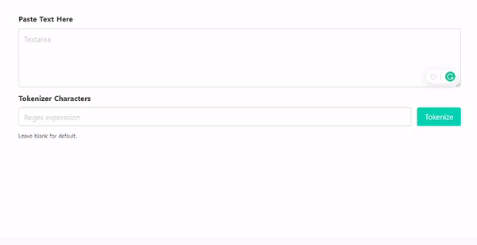

# text-to-anki
> A web app created to convert text into sentence cards and import it into Anki using the AnkiConnect api

> __Requires Anki for desktop and a properly configured AnkiConnect add-on to work__

> More information in the 'How To' section of the website

### Features
- Tokenize text with custom regex
- Export to specific field within a card model to a deck

#### [See Live Website Here](https://tchin25.github.io/text-to-anki/)

---

| Preview |
|:---------:|
||

---

## Build Setup

```bash
# install dependencies
$ yarn install

# serve with hot reload at localhost:3000
# also add localhost:3000 to AnkiConnect's config webCorsOriginList
$ yarn dev

# build for production and launch server
$ yarn build
$ yarn start

# generate static project
$ yarn generate
```
